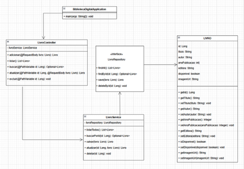

# 📚 Biblioteca POO com Spring Boot

Aplicação Web para Gestão de uma Biblioteca Digital, desenvolvida como **estudo de caso da disciplina de Programação Orientada a Objetos (POO)**. O projeto aplica os conceitos de orientação a objetos na prática, utilizando tecnologias amplamente adotadas no mercado de desenvolvimento de software.

---

## 🎯 Objetivo

Desenvolver um sistema web completo capaz de:

- Cadastrar livros
- Listar livros cadastrados
- Editar dados de livros
- Excluir registros
- Exibir imagens via URL

O sistema conta com **interface intuitiva no frontend** e persistência de dados via **banco de dados relacional no backend**.

---

## 🛠️ Tecnologias Utilizadas

### 🔙 Backend
- Java 17
- Spring Boot
- Spring Data JPA
- MySQL
- Postman (testes de API REST)

### 🔜 Frontend
- HTML5
- CSS3 (reset + customizado)
- JavaScript (Fetch API)

### 💻 Ferramentas de Desenvolvimento
- IntelliJ IDEA (backend)
- Visual Studio Code (frontend)
- MySQL Workbench (modelagem e banco)
- draw.io (criação de diagramas UML)

---

## 🚀 Funcionalidades

- ✅ Cadastro de livros (título, autor, ano, editora, imagem)
- ✅ Listagem de todos os livros cadastrados
- ✅ Edição de informações diretamente no frontend
- ✅ Exclusão de livros
- ✅ Visualização de imagem de capa via URL
- ✅ Comunicação frontend ↔ backend via Fetch API

---

## 📂 Estrutura do Projeto
📦 biblioteca-poo-springboot
├── 📁 backend (Spring Boot)
│ ├── controller/
│ ├── model/
│ ├── repository/
│ ├── service/
│ └── application.properties
├── 📁 frontend
│ ├── index.html
│ ├── script.js
│ └── style/
│ ├── styles.css
│ └── reset.css
├── 📁 img (opcional para testes)
└── README.md


---

## 🧠 Conceitos Trabalhados

- Programação Orientada a Objetos (POO)
- Criação de APIs RESTful com Spring Boot
- Integração frontend e backend com JavaScript
- Manipulação de JSON
- Organização modular de código
- Uso de banco de dados relacional com JPA

---

## 🗃️ Banco de Dados

O projeto utiliza o **MySQL** para armazenamento dos dados.  
A conexão está configurada no arquivo `application.properties`.

Você pode utilizar o H2 para testes locais mudando o datasource.

> 📌 Se necessário, adicione um script `.sql` com o schema do banco na pasta `/scripts`.

---

## 🧪 Como testar

1. **Clone o projeto**:
```bash
git clone https://github.com/Brunacoelhob/biblioteca-poo-springboot.git
Execute o backend com Spring Boot no IntelliJ IDEA

Abra o arquivo index.html da pasta frontend no navegador

Teste as funcionalidades: cadastro, exclusão, edição etc.

## 🖼️ Demonstração da Interface

Veja abaixo uma prévia da aplicação funcionando:



